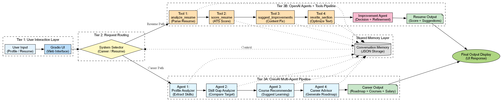

# CareerSuite AI

Your Personal AI Career Assistant - Career Counseling and Resume Review

A real-world implementation of multi-agent AI systems with structured reasoning, tool integration, and memory.

---

## Live Preview



---

## 1. About the Project

**CareerSuite AI** is a multi-agent AI system designed to help users with two critical career tasks:

1. **Career Counseling** - Get personalized career guidance based on your profile, skills, and goals
2. **Resume Review** - Analyze, improve, and optimize your resume for job applications

This project demonstrates the power of **multi-agent AI systems** where specialized AI agents collaborate to solve complex, multi-step problems. Built using concepts from **CrewAI** and **OpenAI Agents SDK**, it showcases how AI can simulate human-like collaboration in career decision-making.

This project demonstrates real-world AI system design using modular agents, structured reasoning, and scalable architecture.

### Why This Project?

- Helps students and professionals make informed career decisions
- Provides ATS-optimized resume feedback
- Demonstrates real-world AI agent collaboration patterns
- Perfect for interview assignments and portfolio demonstration

---

## 2. Features

### Career Counselor
- **4 AI Agents working in pipeline**: Profile Analyzer, Skill Gap Analyzer, Course Recommender, Career Advisor
- Context-aware memory that remembers previous interactions
- Personalized learning plans based on budget and time commitment
- Detailed career roadmap with monthly milestones

### Resume Reviewer  
- **2 AI Agents with 4 Tools**: Analyze, Suggest Improvements, ATS Score, Rewrite Summary
- ATS (Applicant Tracking System) compatibility scoring
- Specific improvement suggestions with examples
- Professional summary rewriting

### General
- Beautiful Gradio-based UI with tabbed interface
- Real-time collaboration indicators showing agent progress
- Branded with "CareerSuite AI" identity
- Mock outputs for demonstration (no API key needed)

---

## 3. How the System Works

### Career Counselor Flow

```
User Input (Profile, Career, Budget, Time)
         │
         v
┌────────┴────────┐
│  Profile       │ (1) Analyzes education, skills, experience
│  Analyzer      │
│  Agent         │
└────────┬────────┘
         │
         v
┌────────┴────────┐
│  Skill Gap     │ (2) Identifies missing skills for target career
│  Analyzer      │
└────────┬────────┘
         │
         v
┌────────┴────────┐
│  Course         │ (3) Recommends courses based on budget
│  Recommender    │
└────────┬────────┘
         │
         v
┌────────┴────────┐
│  Career         │ (4) Creates comprehensive roadmap
│  Advisor        │
└────────┬────────┘
         │
         v
      Output
```

### Resume Reviewer Flow

```
User Input (Resume, Job Role, Action)
         │
         v
    ┌────┴────┐
    │ Resume  │──► Analyze → Structure, content, ATS score
    │ Analyzer│──► Suggest Improvements → Specific fixes
    │ Agent   │──► ATS Score → 0-100 scoring
    │         │──► Rewrite Summary → Better version
    └─────────┘
         │
         v
      Output
```

---

## 4. Architecture

The system follows a multi-layered architecture with agent orchestration and tool execution, as shown below:

```
┌─────────────────────────────────────────┐
│           UI Layer (Gradio)            │
│   Career Counselor | Resume Reviewer   │
└─────────────────┬───────────────────────┘
                  │
┌─────────────────┴───────────────────────┐
│         Agent Orchestration Layer       │
│   (Profile Analyzer, Skill Gap, etc.)   │
└─────────────────┬───────────────────────┘
                  │
┌─────────────────┴───────────────────────┐
│         Tool Execution Layer            │
│    (analyze, score, suggest, rewrite)   │
└─────────────────┬───────────────────────┘
                  │
┌─────────────────┴───────────────────────┐
│           Memory Layer (JSON)           │
│      Context-Aware Conversation        │
└─────────────────────────────────────────┘
```

---

## 5. Installation

### Prerequisites
- Python 3.8 or higher
- Anaconda (recommended)

### Step-by-Step

```bash
# Clone the repository
git clone <your-repo-url>
cd CareerSuite-AI

# Create and activate environment
conda create -n career_ai python=3.10
conda activate career_ai

# Install dependencies
pip install -r requirements.txt
```

---

## 6. API Setup

### Option A: Use Mock Mode (For Demo)
The app works out-of-the-box with **mock outputs** - no API key needed. This is perfect for:
- Demo videos
- Portfolio projects
- Assignment submissions

### Option B: Use Real API (Optional)
For live AI responses, you can add an OpenAI API key:

1. Get an API key from [OpenAI Platform](https://platform.openai.com/api-keys)
2. Create a `.env` file in the project root (a sample `.env.example` file is provided):
   ```
   OPENAI_API_KEY=sk-your-api-key-here
   ```
3. The system will use real AI when API key is available

**Note:** The current version uses mock outputs for demonstration reliability.

---

## 7. How to Run

```bash
python app.py
```

Then open your browser to: `http://localhost:7860`

---

## 8. How to Use

### Career Counselor
1. Enter your profile details (education, skills, experience)
2. Select your **Target Career** from dropdown
3. Choose **Learning Budget** (Low/Moderate/High)
4. Select **Time Commitment** (Part-time/Full-time)
5. Click **"Get Career Guidance"**
6. View your personalized career roadmap

### Resume Reviewer
1. Select **Target Job Role** from dropdown
2. Choose an **Action**:
   - Analyze - Full resume review
   - Suggest Improvements - Specific fixes
   - ATS Score - Scoring out of 100
   - Rewrite Summary - Better professional summary
3. Paste your resume text
4. Click **"Analyze Resume"**
5. View detailed feedback

---

## 9. Sample Input/Output

### Career Counselor Example

**Input:**
- Target Career: Data Scientist
- Budget: Moderate
- Time: Part-time

**Output includes:**
- Profile Analysis (strengths, experience level)
- Skill Gap Analysis (what to learn)
- Learning Plan (4 phases over 12 months)
- Project Portfolio Strategy
- Salary Trajectory

### Resume Reviewer Example

**Action: ATS Score**

**Output:**
- Total Score: 78/100
- Breakdown by criteria (Structure, Keywords, Achievements, etc.)
- What's working
- Areas to improve
- Recommended keywords to add

---

## 10. Project Structure

```
CareerSuite-AI/
├── app.py                  # Main Gradio UI
├── README.md               # This file
├── .env.example           # Sample environment configuration
│
├── CrewAI_Career_Counselor/
│   ├── crew/
│   │   └── career_crew.py # 4-agent orchestration
│   ├── agents/            # Agent definitions
│   ├── memory/            # Conversation memory
│   └── .env               # API configuration
│
├── OpenAI_Resume_Reviewer/
│   ├── agents/
│   │   └── resume_agents.py  # 2-agent + 4 tools
│   ├── memory/               # Resume memory
│   └── .env                  # API configuration
│
└── FINAL_AI_ARCHITECTURE.png  # Architecture diagram
```

---

## 11. Advanced Features

### Context-Aware Memory
The system saves conversation history to JSON files:
- `memory.json` for Career Counselor
- `resume_memory.json` for Resume Reviewer

This enables:
- Follow-up queries within session
- Context preservation across interactions
- Demonstration of memory patterns

### Agent Collaboration Indicators
The UI shows:
- "Agents are Collaborating..."
- Pipeline flow: Agent 1 > Agent 2 > Agent 3 > Agent 4

This demonstrates the multi-agent collaboration concept clearly.

---

## 12. Author

**Jijnash Kumar M**  
B.Tech, Artificial Intelligence and Machine Learning  
SRM Institute of Science and Technology, Tiruchirappalli  
IIT Jammu Internship Assignment

---

## 13. Notes & Limitations

### Current Status
- **Mock outputs** are used for demonstration reliability
- Works without any API key for immediate testing
- Ideal for portfolio demonstration, academic evaluation, and interview discussions

### For Real Usage
- Add OpenAI API key for live AI responses
- Replace mock data in functions with actual API calls
- Consider rate limits and billing when using real APIs

### Assignment Context
This project was built for an IIT Jammu internship assignment demonstrating:
- Multi-agent AI systems (CrewAI pattern)
- Tool-augmented agents (OpenAI SDK pattern)
- Professional UI with Gradio
- Clean code organization

---

## 14. License

Copyright 2026 CareerSuite AI by Jijnash Kumar M

---

*Built with Gradio*